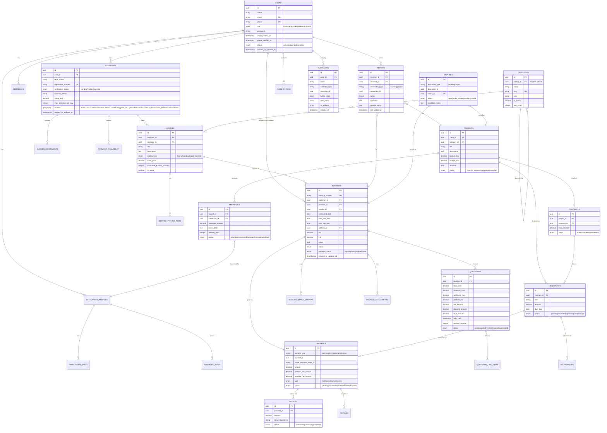

# Data Model & Performance

Source: SRS §2 (ERD) and §18 (indexing, caching, query strategy). The ERD is also available standalone at `../assets/erd.mmd`; the index DDL at `../assets/indexes.sql`.

**Contents:** ERD · Schema notes (UUIDv7, polymorphism, append-only tables, money columns) · Indexing strategy · PostGIS radius search · Caching · N+1 prevention

---

## 2. Database Schema (ERD)



**Notes**
- All primary keys are UUIDv7 (sortable) to avoid enumeration and to work cleanly with distributed IDs if services split later.
- `PAYMENTS.payable_type/payable_id` and `REVIEWS.reviewable_type/reviewable_id` are polymorphic — one payments table serves both booking and milestone payments; one reviews table serves both booking and project reviews.
- `BOOKING_STATUS_HISTORY` and `AUDIT_LOGS` are append-only (no updates/deletes at the application layer) — enforced via a Postgres trigger or a model-level `Immutable` trait that blocks `update()`/`delete()`.
- Money columns are `decimal(12,2)` never float. Currency stored per-row (`currency` char(3)) for future multi-currency support.


---

## 18. Performance Optimization & Database Indexing

**Indexing strategy** (PostgreSQL):

```sql
-- Booking lookups by provider + date (double-booking checks, calendar views)
CREATE INDEX idx_bookings_provider_date ON bookings (provider_id, scheduled_date, time_slot_start);
CREATE INDEX idx_bookings_customer ON bookings (customer_id, status);
CREATE INDEX idx_bookings_status ON bookings (status) WHERE status NOT IN ('completed','cancelled');

-- Service discovery / browse
CREATE INDEX idx_services_category_active ON services (category_id) WHERE is_active = true;
CREATE INDEX idx_services_geo ON businesses USING GIST (location); -- geography(Point,4326), PostGIS for radius search

-- "Find providers near me": client sends lat/lng from the Browser Geolocation API,
-- the API runs exactly this query — no geocoding call, no application-side haversine:
-- SELECT * FROM businesses
-- WHERE ST_DWithin(location, ST_MakePoint(:lng, :lat)::geography, :radius_meters);

-- Quotation expiry sweep
CREATE INDEX idx_quotations_status_validuntil ON quotations (status, valid_until) WHERE status = 'sent';

-- Audit log queries
CREATE INDEX idx_audit_actor_date ON audit_logs (actor_id, created_at);
CREATE INDEX idx_audit_entity ON audit_logs (auditable_type, auditable_id);

-- Reviews aggregation
CREATE INDEX idx_reviews_reviewee ON reviews (reviewee_id);
```

- **PostGIS** extension for geo radius queries: `ST_DWithin` against the `geography(Point)` column is the only operation the API runs for provider search — instead of naive haversine in application code or a maps-provider "nearby search" API call. Coordinates for "near me" come straight from the browser's **Geolocation API**; coordinates for a saved service address come from the one-time Geoapify/LocationIQ geocode captured at signup.
- **Read replicas** for the admin analytics dashboard and reporting queries once traffic warrants it — analytics never hits the primary write connection.
- **Caching**: category tree, service pricing, and platform settings cached in Redis with tagged invalidation on admin writes; provider availability cached per-day with short TTL (5 min) since it changes frequently.
- **Eager loading everywhere**: API Resources paired with `->with([...])` on every list query; N+1 caught in CI via `barryvdh/laravel-debugbar` assertions or `spatie/laravel-query-detector` in non-prod.
- **Materialized view** (or an hourly snapshot table, `admin_dashboard_metrics`) for the analytics dashboard so heavy aggregation queries don't run on every page load.

