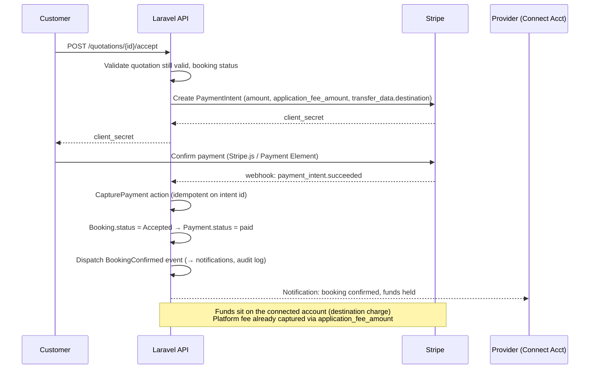

# Payments — Stripe Connect

Source: SRS §7. Related: the payment queue jobs in `backend-conventions.md`, payment validation rules in `validation-rules.md`, and the `PAYMENTS`/`PAYOUTS`/`REFUNDS` tables in `data-model.md`.

**Contents:** Connect model · Booking payment sequence · Freelance milestone escrow · Supported methods & deposits · Webhook handling

---

## 7. Stripe Payment Integration

**Model:** Stripe Connect (Standard or Express accounts) for providers/freelancers, platform as the connected-account owner, using **destination charges with `application_fee_amount`** for direct bookings and **manual transfers held until milestone approval** for freelance escrow.

**Escrow (freelance milestones):** platform charges the client into the **platform's own balance** (no immediate `transfer_data`), holding funds until `POST /milestones/{id}/approve`, at which point a `Transfer` is created to the freelancer's connected account minus the platform fee. This gives the platform a true hold rather than relying on Stripe's connected-account balance for disputed funds.

**Supported:** Cards, Apple Pay, Google Pay via Stripe **Payment Element** (auto-detects wallets). Partial payments/deposits via a `deposit_percentage` on the quotation, tracked as a separate `Payment` row with `type=deposit`; remainder captured on completion. Refunds via `Refund` model + Stripe Refund API, always admin-authorized above a configurable threshold.

**Webhook handling:** single `StripeWebhookController` verifies signature, writes the raw event to an `stripe_events` table first (dedupe by `event.id`) before dispatching a queued job to process it — this makes replay-safe and survives worker crashes mid-processing.

