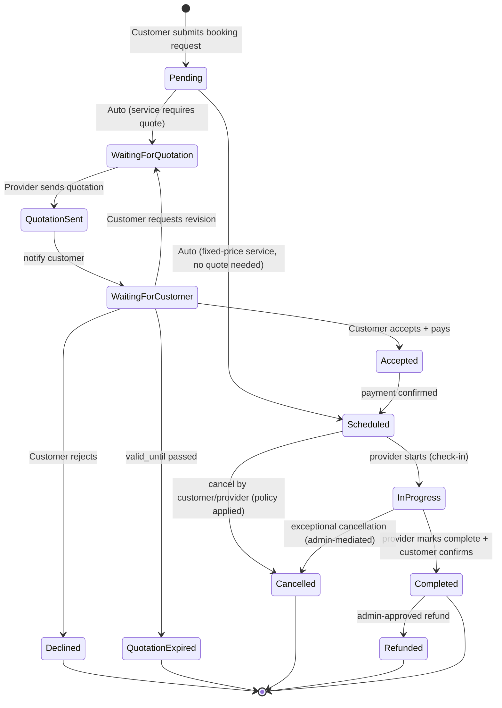
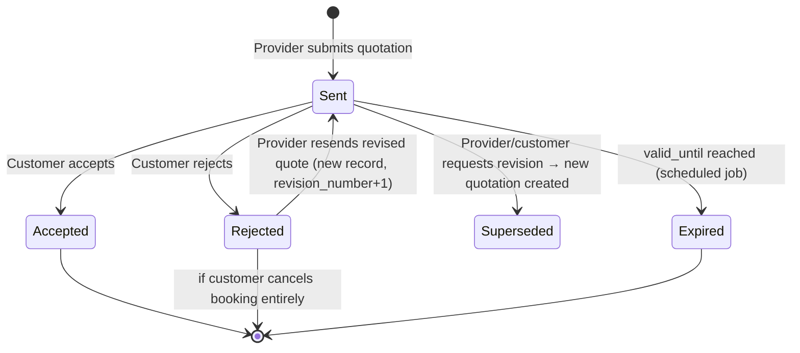
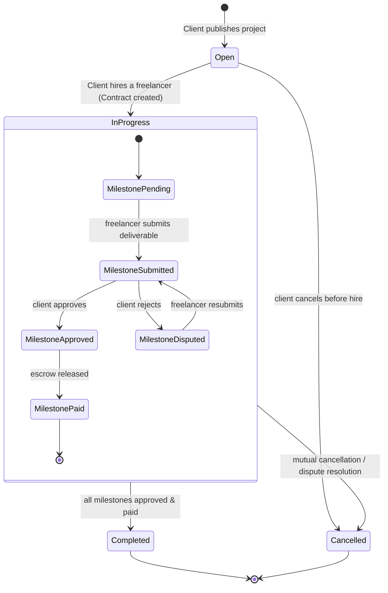
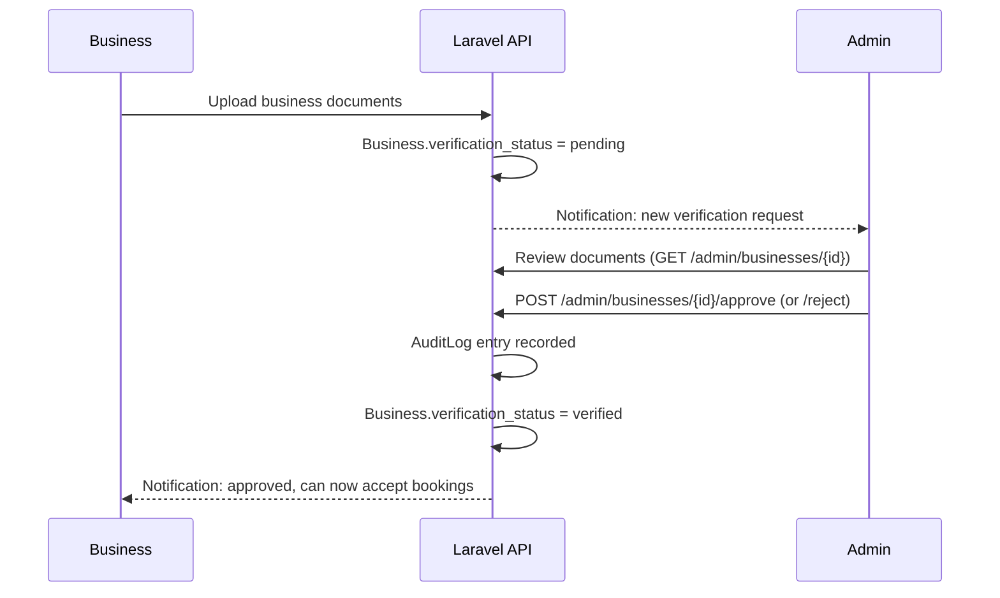

# Workflows & State Machines

Source: SRS §8–§13. Every diagram here maps to a StateMachine class in `app/Domain/*/StateMachines/` — see `backend-conventions.md`. The diagrams are also available standalone at `../assets/state-machines.mmd`.

**Contents:** Booking states · Quotation states & reminder cadence · Freelancer project & milestone states · Notification workflow · Admin workflow · Audit trail design

---

## 8. Booking Workflow — State Diagram



---

## 9. Quotation Workflow — State Diagram



Reminder cadence (configurable, defaults): T-24h and T-2h before `valid_until` → customer reminder notification; provider reminded daily if no quotation sent within 48h of request, booking auto-expires after 5 days (both windows admin-configurable in `platform_settings`).

---

## 10. Freelancer Project Workflow — State Diagram



Hiring is exclusive per project: `HireFreelancer` action wraps `Project` + `Proposal` update in a DB transaction with a row lock (`lockForUpdate`) on the project to prevent a race where two proposals are accepted concurrently; all other open proposals are auto-transitioned to `rejected` with a notification.

---

## 11. Notification Workflow

```mermaid
sequenceDiagram
    participant Domain as Domain Action (e.g. AcceptQuotation)
    participant Event as Laravel Event Bus
    participant Queue as Queue Worker
    participant Chan as Notification Channels

    Domain->>Event: fire QuotationAccepted event
    Event->>Queue: SendQuotationAcceptedNotifications (queued listener)
    Queue->>Chan: database (in-app)
    Queue->>Chan: mail
    Queue->>Chan: web push (browser Push API / VAPID)
    Queue->>Chan: mobile push (FCM/APNs, if a device token is registered)
    Queue->>Chan: sms (Twilio, if enabled for this event type)
    Note over Queue,Chan: Each channel failure logged independently;<br/>one channel failing doesn't block others (Notification::send per-channel try/catch)
```

Every notification event in the spec (booking created/accepted/cancelled, quotation sent/accepted/rejected, payment succeeded, refund processed, proposal received, freelancer hired, milestone submitted/approved, review received, payout completed) maps to one `Illuminate\Notification` class implementing `via()` per-user-preference (users can opt out of email/SMS/push per category in a `notification_preferences` table, in-app is always on).

**[MOBILE ADDITION] Mobile push channel:** the React Native app registers its device token on login/foreground via `POST /devices/register` (new `device_tokens` table: `user_id`, `platform` enum `ios|android`, `push_token`, `last_used_at` — additive, same shape as the existing `notification_preferences` table, no changes to any other table). A new `MobilePushChannel` (backed by Firebase Cloud Messaging, which fans out to both FCM/Android and APNs/iOS from one API) is added to each notification's `via()` list alongside the existing channels — same per-channel try/catch isolation, same opt-out table (`notification_preferences` gains a `push_mobile` boolean column). Tokens that FCM reports as unregistered (app uninstalled) are pruned automatically on send failure.

---

## 12. Admin Workflow



Admin surfaces: verification queue (business + freelancer), category manager (CRUD, drag-reorder), platform fee config (global default + per-category overrides), dispute manager (assign, resolve, refund authority), payout batch monitor, audit log explorer (filterable by actor/action/date/entity), analytics dashboard (§15).

---

## 13. Audit Trail Design

- Single `audit_logs` table, **insert-only**, populated by a global listener (`RecordAuditEntry`) subscribed to a marker interface `Auditable` implemented by every domain event that represents a critical action (approvals, suspensions, refunds, payouts, status transitions, admin overrides).
- Each entry captures `actor_id`, `action` (dot-notation, e.g. `booking.status_changed`), `auditable_type/id`, `before_state`/`after_state` (JSONB diffs, not full snapshots, to keep rows small), `ip_address`, `user_agent`, `created_at`.
- Retention: audit logs are never deleted by the application; archival to cold storage (e.g. S3 Glacier via a scheduled export) after 2 years, configurable.
- Read access gated by `AuditLogPolicy` — admins see everything; providers/freelancers can query a scoped view of entries where they are the actor or the subject entity is theirs (for transparency on disputes).

