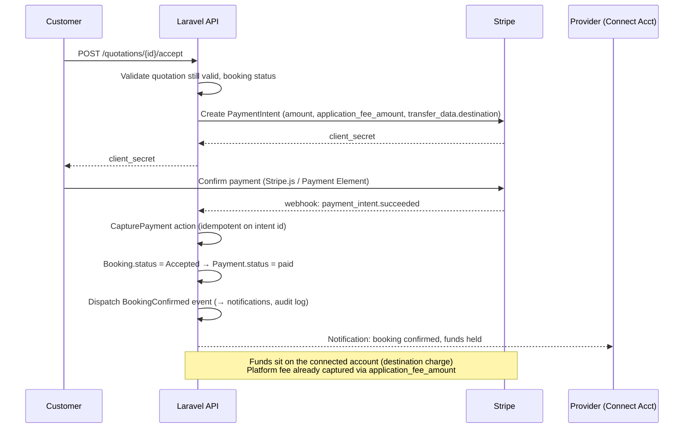
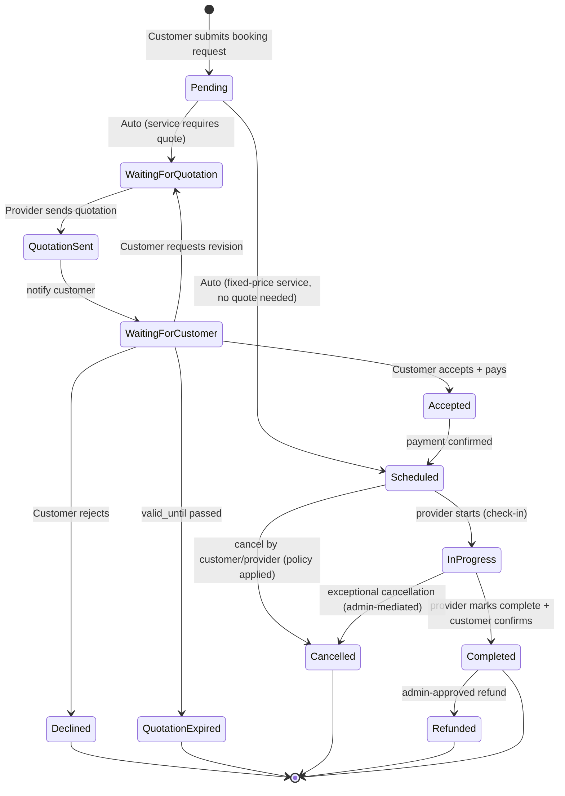
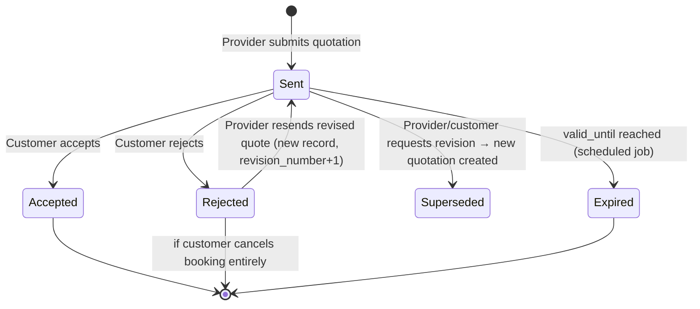
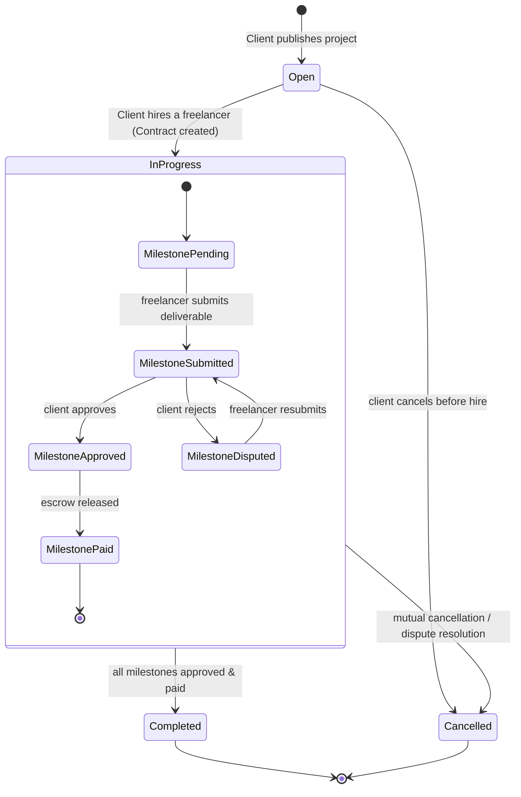
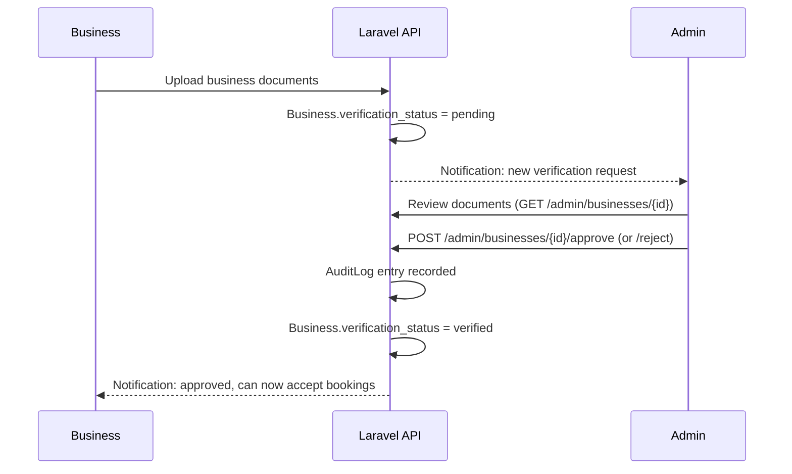

# Multi-Service Marketplace Platform
## Software Requirements Specification & Technical Design Document

**Stack:** Laravel 12 · React + TypeScript (responsive SPA, no native app) · PostgreSQL + PostGIS · Sanctum · S3-compatible storage · Stripe · FullCalendar · Leaflet + OpenStreetMap · Geoapify/LocationIQ geocoding

---

## 1. System Architecture

The platform is a **single responsive web application** — there is no separate downloadable/native mobile app. Customers, providers, and admins all use the same React SPA through a browser, with layout and interaction patterns that adapt across desktop and mobile viewports (responsive breakpoints, touch-friendly controls, no device-specific build).

```
                                   ┌───────────────────────┐
                                   │   React SPA (TS)       │
                                   │  Responsive web app —  │
                                   │  Customer / Provider /  │
                                   │  Admin, desktop + mobile │
                                   │  browsers (no native app)│
                                   └──────────┬───────────┘
                                              │ HTTPS/JSON (Axios)
                                   ┌──────────▼───────────┐
                                   │   Nginx / Load Bal.   │
                                   └──────────┬───────────┘
                                              │
                     ┌────────────────────────▼────────────────────────┐
                     │              Laravel 12 API (Sanctum)            │
                     │  Modular monolith, domain-driven module split    │
                     └───┬─────────┬─────────┬─────────┬────────┬──────┘
                         │         │         │         │        │
                 ┌───────▼──┐ ┌────▼───┐ ┌───▼────┐ ┌──▼─────┐ ┌▼──────────┐
                 │PostgreSQL│ │ Redis  │ │  S3 /   │ │ Stripe │ │ Geoapify /│
                 │+ PostGIS │ │(cache, │ │ Spaces  │ │  API   │ │ LocationIQ│
                 │(primary) │ │queue,  │ │(files)  │ │        │ │(geocoding)│
                 │          │ │sessions│ │         │ │        │ │           │
                 └──────────┘ └───┬────┘ └─────────┘ └────────┘ └───────────┘
                                  │
                       ┌──────────▼──────────┐
                       │ Laravel Queue Workers │
                       │ (notifications, payouts,
                       │  quotation expiry, etc.)│
                       └──────────┬───────────┘
                                  │
                       ┌──────────▼──────────┐
                       │  Laravel Scheduler   │
                       │ (cron-driven jobs)   │
                       └──────────────────────┘

     External: Mail provider (SES/Postmark), SMS provider (Twilio, optional),
               Web Push (browser Push API via service worker + VAPID,
               delivered through Laravel Notification channels),
               map tiles (MapTiler / Stadia Maps, OSM-derived)
```

**Design principles**
- **Modular monolith** (not microservices) for v1 — one Laravel codebase organized into bounded-context modules (`app/Domain/{Booking,Quotation,Freelance,Payment,User,Notification,Admin}`), each with its own models, services, actions, events, and policies. This keeps deployment simple while preserving clean seams for future extraction into services.
- **CQRS-lite**: write paths go through Action classes (single-responsibility, testable); read paths use dedicated Query classes / API Resources to avoid N+1 and over-fetching.
- **Event-driven side effects**: state transitions (booking accepted, payment captured, milestone approved) fire domain events consumed by queued listeners — this is what powers notifications, audit logging, and payout scheduling without coupling core logic to peripheral concerns.
- **Idempotency** at the API boundary for payment and webhook endpoints (Stripe webhooks, retavailable client actions) via an `idempotency_keys` table.

**Location & geocoding architecture (no Google Maps):** map rendering uses **Leaflet** (`react-leaflet`) with OpenStreetMap-derived tiles served through **MapTiler** or **Stadia Maps** — both are OSM-based with generous free tiers and paid plans that stay cheap at scale; raw `tile.openstreetmap.org` is not usable for production/commercial traffic under OSM's tile usage policy, so a tile provider (or self-hosted tile server, e.g. TileServer GL, once volume justifies it) sits in front of it. Beyond tile rendering, the platform has four distinct location use cases, each handled with the lightest tool that fits rather than one general-purpose maps API:

| Use Case | Approach |
|---|---|
| **Signup / Set Service Address** | **Leaflet** map with a draggable pin as the primary input method, paired with a text address field. The pin can be dragged directly to the exact spot; the text field is only geocoded when the form is submitted, not on every keystroke. |
| **One-time Address → Coordinates** | **Geoapify** or **LocationIQ** (free tier) for one-time geocoding of the submitted address. A few thousand free geocoding requests per month comfortably covers expected signup volume. |
| **Find Providers Near Me** | Browser **Geolocation API** (`navigator.geolocation.getCurrentPosition`) returns the user's latitude/longitude directly in the client — no geocoding call is made for this feature. |
| **Radius Search** | **PostGIS `ST_DWithin`** against the stored `geography(Point)` column (§18) finds nearby providers efficiently. This is the only operation the API executes for provider search — never a naive haversine calculation in application code, and never a second geocoding call. |

Server-side radius search stays on PostGIS regardless of which geocoding provider is used for the one-time address lookup, since it's a database concern, not a maps-API concern.

---

## 2. Database Schema (ERD)

```mermaid
erDiagram
    USERS ||--o{ BUSINESSES : owns
    USERS ||--o{ FREELANCER_PROFILES : has
    USERS ||--o{ BOOKINGS : "requests as customer (nullable — guest bookings have none)"
    BOOKINGS ||--o{ BOOKING_ACCESS_TOKENS : "granted to guest"
    USERS ||--o{ ADDRESSES : has
    BUSINESSES ||--o{ SERVICES : offers
    BUSINESSES ||--o{ BUSINESS_DOCUMENTS : uploads
    BUSINESSES ||--o{ PROVIDER_AVAILABILITY : defines
    FREELANCER_PROFILES ||--o{ FREELANCER_SKILLS : lists
    FREELANCER_PROFILES ||--o{ PORTFOLIO_ITEMS : shows
    CATEGORIES ||--o{ CATEGORIES : "parent/child"
    CATEGORIES ||--o{ SERVICES : classifies
    SERVICES ||--o{ SERVICE_PRICING_TIERS : has
    SERVICES ||--o{ BOOKINGS : "booked as"
    BOOKINGS ||--o{ QUOTATIONS : receives
    BOOKINGS ||--o{ BOOKING_STATUS_HISTORY : logs
    BOOKINGS ||--o{ BOOKING_ATTACHMENTS : has
    BOOKINGS ||--|| PAYMENTS : "paid via"
    QUOTATIONS ||--o{ QUOTATION_LINE_ITEMS : itemizes
    PROJECTS ||--o{ PROPOSALS : receives
    PROJECTS ||--o{ MILESTONES : "broken into"
    PROJECTS ||--o| CONTRACTS : "results in"
    PROPOSALS }o--|| FREELANCER_PROFILES : "submitted by"
    CONTRACTS ||--o{ MILESTONES : tracks
    MILESTONES ||--o{ DELIVERABLES : "submitted for"
    MILESTONES ||--o| PAYMENTS : "released via"
    PAYMENTS ||--o{ PAYOUTS : "settled into"
    PAYMENTS ||--o{ REFUNDS : "may have"
    USERS ||--o{ REVIEWS : writes
    REVIEWS }o--|| BOOKINGS : "for"
    REVIEWS }o--|| PROJECTS : "for"
    USERS ||--o{ NOTIFICATIONS : receives
    USERS ||--o{ AUDIT_LOGS : "acted by"
    DISPUTES }o--|| BOOKINGS : "raised on"
    DISPUTES }o--|| PROJECTS : "raised on"

    USERS {
        uuid id PK
        string name
        string email UK
        string phone UK
        enum role "customer|provider|freelancer|admin"
        string password
        timestamp email_verified_at
        timestamp phone_verified_at
        enum status "active|suspended|pending"
        timestamps created_at_updated_at
    }
    BUSINESSES {
        uuid id PK
        uuid user_id FK
        string legal_name
        string registration_number UK
        enum verification_status "pending|verified|rejected"
        jsonb business_hours
        decimal rating_avg
        integer max_bookings_per_day
        geography location "Point,4326 — service location, set via Leaflet draggable pin + geocoded address; used by PostGIS ST_DWithin radius search"
        timestamps created_at_updated_at
    }
    CATEGORIES {
        uuid id PK
        uuid parent_id FK "nullable, self-ref"
        string name
        string slug UK
        string icon
        boolean is_active
        integer sort_order
    }
    SERVICES {
        uuid id PK
        uuid business_id FK
        uuid category_id FK
        string title
        text description
        enum pricing_type "hourly|fixed|package|inspection"
        decimal base_price
        integer estimated_duration_minutes
        boolean is_active
    }
    BOOKINGS {
        uuid id PK
        string booking_number UK
        uuid customer_id FK "nullable — null for a guest booking"
        string guest_name "nullable — set iff customer_id is null"
        string guest_email "nullable"
        string guest_phone "nullable"
        string guest_email_normalized "nullable, indexed — lowercased/trimmed, drives claiming"
        uuid claimed_by_user_id FK "nullable — set when a verified account claims the booking"
        timestamp claimed_at "nullable"
        uuid provider_id FK
        uuid service_id FK
        date scheduled_date
        time time_slot_start
        time time_slot_end
        uuid address_id FK "nullable — registered users only"
        string service_address_line1 "denormalized snapshot, always populated"
        string service_address_line2
        string service_address_city
        string service_address_province
        string service_address_postal_code
        geography service_location "Point,4326 — GIST-indexed snapshot of the service address"
        decimal lat
        decimal lng
        text notes
        enum status
        enum payment_status "unpaid|partial|paid|refunded"
        timestamps created_at_updated_at
    }
    BOOKING_ACCESS_TOKENS {
        uuid id PK
        uuid booking_id FK
        string token_hash UK "sha256 of the plaintext — plaintext is never stored"
        timestamp expires_at
        timestamp last_used_at
        timestamp revoked_at "set when the booking is claimed"
        string created_ip
        timestamps created_at_updated_at
    }
    QUOTATIONS {
        uuid id PK
        uuid booking_id FK
        decimal labor_cost
        decimal materials_cost
        decimal additional_fees
        decimal platform_fee
        decimal tax_amount
        decimal discount_amount
        decimal total_amount
        timestamp valid_until
        integer revision_number
        enum status "sent|accepted|rejected|expired|superseded"
    }
    PROJECTS {
        uuid id PK
        uuid client_id FK
        uuid category_id FK
        string title
        text description
        decimal budget_min
        decimal budget_max
        date deadline
        enum status "open|in_progress|completed|cancelled"
    }
    PROPOSALS {
        uuid id PK
        uuid project_id FK
        uuid freelancer_id FK
        decimal proposed_amount
        text cover_letter
        integer delivery_days
        enum status "submitted|shortlisted|accepted|rejected|withdrawn"
    }
    CONTRACTS {
        uuid id PK
        uuid project_id FK
        uuid proposal_id FK
        decimal total_amount
        enum status "active|completed|terminated"
    }
    MILESTONES {
        uuid id PK
        uuid contract_id FK
        string title
        decimal amount
        date due_date
        enum status "pending|submitted|approved|paid|disputed"
    }
    PAYMENTS {
        uuid id PK
        string payable_type "polymorphic: booking|milestone"
        uuid payable_id
        string stripe_payment_intent_id
        decimal amount
        decimal platform_fee_amount
        decimal provider_net_amount
        enum type "full|deposit|partial|escrow"
        enum status "pending|succeeded|failed|refunded|disputed"
    }
    PAYOUTS {
        uuid id PK
        uuid provider_id FK
        decimal amount
        string stripe_transfer_id
        enum status "scheduled|processing|paid|failed"
    }
    REVIEWS {
        uuid id PK
        uuid reviewer_id FK
        uuid reviewee_id FK
        string reviewable_type "booking|project"
        uuid reviewable_id
        tinyint rating
        text comment
        text provider_reply
        timestamp edit_locked_at
    }
    AUDIT_LOGS {
        uuid id PK
        uuid actor_id FK
        string action
        string auditable_type
        uuid auditable_id
        jsonb before_state
        jsonb after_state
        string ip_address
        timestamp created_at
    }
    DISPUTES {
        uuid id PK
        string disputable_type "booking|project"
        uuid disputable_id
        uuid raised_by FK
        enum status "open|under_review|resolved|closed"
        text resolution_notes
    }
```



**Notes**
- All primary keys are UUIDv7 (sortable) to avoid enumeration and to work cleanly with distributed IDs if services split later.
- `PAYMENTS.payable_type/payable_id` and `REVIEWS.reviewable_type/reviewable_id` are polymorphic — one payments table serves both booking and milestone payments; one reviews table serves both booking and project reviews.
- `BOOKING_STATUS_HISTORY` and `AUDIT_LOGS` are append-only (no updates/deletes at the application layer) — enforced via a Postgres trigger or a model-level `Immutable` trait that blocks `update()`/`delete()`.
- Money columns are `decimal(12,2)` never float. Currency stored per-row (`currency` char(3)) for future multi-currency support.

---

## 3. Laravel Module Structure

```
app/
├── Domain/
│   ├── User/
│   │   ├── Models/ (User, Address)
│   │   ├── Actions/ (RegisterCustomer, RegisterBusiness, RegisterFreelancer)
│   │   ├── Policies/
│   │   └── Events/ (UserRegistered, UserVerified)
│   ├── Business/
│   │   ├── Models/ (Business, BusinessDocument, ProviderAvailability)
│   │   ├── Actions/ (SubmitForVerification, ApproveBusiness, RejectBusiness)
│   │   └── Services/ (AvailabilityService)
│   ├── Freelance/
│   │   ├── Models/ (FreelancerProfile, PortfolioItem, Project, Proposal, Contract, Milestone, Deliverable)
│   │   ├── Actions/ (PublishProject, SubmitProposal, HireFreelancer, SubmitMilestone, ApproveMilestone)
│   │   └── StateMachines/ (ProjectStateMachine, MilestoneStateMachine)
│   ├── Catalog/
│   │   ├── Models/ (Category, Service, ServicePricingTier)
│   │   └── Actions/ (CreateCategory, PublishService)
│   ├── Booking/
│   │   ├── Models/ (Booking, BookingStatusHistory, BookingAttachment)
│   │   ├── Actions/ (CreateBookingRequest, TransitionBookingStatus, CancelBooking)
│   │   ├── StateMachines/ (BookingStateMachine.php)
│   │   └── Validators/ (BookingAvailabilityValidator, DoubleBookingValidator)
│   ├── Quotation/
│   │   ├── Models/ (Quotation, QuotationLineItem)
│   │   ├── Actions/ (SendQuotation, AcceptQuotation, RejectQuotation, ReviseQuotation)
│   │   └── Jobs/ (ExpireStaleQuotations)
│   ├── Payment/
│   │   ├── Models/ (Payment, Payout, Refund)
│   │   ├── Services/ (StripePaymentService, StripeConnectPayoutService, EscrowService)
│   │   ├── Actions/ (CapturePayment, IssueRefund, ReleaseMilestoneEscrow)
│   │   └── Webhooks/ (StripeWebhookController)
│   ├── Review/
│   │   ├── Models/ (Review)
│   │   └── Actions/ (SubmitReview, ReplyToReview)
│   ├── Notification/
│   │   ├── Notifications/ (BookingCreated, QuotationSent, PaymentSucceeded, …)
│   │   └── Channels/ (WebPushChannel, SmsChannel)
│   ├── Dispute/
│   │   ├── Models/ (Dispute)
│   │   └── Actions/ (RaiseDispute, ResolveDispute)
│   └── Audit/
│       ├── Models/ (AuditLog)
│       └── Listeners/ (RecordAuditEntry — subscribes to all domain events)
├── Http/
│   ├── Controllers/Api/{Customer,Provider,Freelancer,Admin}/...
│   ├── Requests/  (FormRequest per action, one class per validated intent)
│   ├── Resources/ (API Resources — one per read model)
│   └── Middleware/ (EnsureVerified, EnsureNotSuspended, RoleMiddleware)
├── Policies/
├── Providers/
└── Console/
    ├── Commands/ (ExpireQuotations, RunPayoutBatch, SendBookingReminders)
    └── Kernel.php (scheduler definitions)
```

**Key architectural pattern:** every state transition (Booking, Quotation, Project, Milestone) is routed through a dedicated **StateMachine class** that defines the allowed transition graph and rejects illegal transitions with a typed exception — this is what the validation rules in §13 map onto, and it's the single source of truth so the same rules can't drift between the API and, e.g., a queued job that also mutates status.

---

## 4. React Folder Structure

```
src/
├── app/                        # app shell, providers, router
│   ├── routes/
│   │   ├── customer/
│   │   ├── provider/
│   │   ├── freelancer/
│   │   └── admin/
│   └── providers/ (AuthProvider, QueryClientProvider, ToastProvider)
├── features/                   # feature-sliced, mirrors backend domains
│   ├── auth/
│   ├── booking/
│   │   ├── components/ (BookingWizard, ScheduleStep,
│   │   │                 LocationStep — Leaflet draggable pin + address field,
│   │   │                 geocoded via Geoapify/LocationIQ on submit)
│   │   ├── hooks/ (useCreateBooking, useBookingStatus)
│   │   └── api/ (bookingApi.ts)
│   ├── quotation/
│   ├── catalog/
│   ├── freelance/
│   │   ├── projects/
│   │   ├── proposals/
│   │   └── milestones/
│   ├── payments/ (StripeCheckoutForm, PayoutDashboard)
│   ├── reviews/
│   ├── notifications/
│   └── admin/ (BusinessApprovalQueue, DisputeManager, AnalyticsDashboard)
├── components/                 # shared/dumb UI (design-system layer)
├── lib/
│   ├── api/ (axios instance, interceptors, error normalization)
│   ├── maps/ (Leaflet draggable-pin map component, useBrowserGeolocation hook,
│   │          Geoapify/LocationIQ geocoding client — called only on form submit)
│   └── calendar/ (FullCalendar config + adapters)
├── types/                      # shared TS types, generated from OpenAPI if possible
└── stores/                     # Zustand/Redux slices for cross-cutting client state
```

- Data fetching via **TanStack Query** (React Query) — server state is never duplicated into a global store.
- Types generated from the Laravel OpenAPI spec (via `dedoc/scramble` or `zircote/swagger-php`) to keep FE/BE contracts in sync automatically.

---

## 5. API Design (RESTful)

Base: `/api/v1`. Versioned from day one. All authenticated routes via Sanctum, using SPA cookie mode for the responsive web app (the sole client).

| Domain | Method | Endpoint | Purpose |
|---|---|---|---|
| Auth | POST | `/auth/register/customer` | Customer signup |
| | POST | `/auth/register/business` | Business signup (starts verification) |
| | POST | `/auth/register/freelancer` | Freelancer signup |
| | POST | `/auth/login` / `/auth/logout` | Session |
| | POST | `/auth/email/verify/{id}/{hash}` | Email verification |
| | POST | `/auth/otp/verify` | Phone OTP verification |
| Catalog | GET | `/categories` | List categories (tree) |
| | POST | `/admin/categories` | Admin creates category (no-code) |
| | GET | `/services?category=&location=&sort=` | Browse services |
| | GET | `/services/{id}/pricing` | Estimated pricing before booking |
| Booking | POST | `/bookings` | Create booking request — **public**; authenticated or guest (§6.1) |
| | GET | `/bookings` | List own bookings (registered customers only) |
| | GET | `/bookings/{id}` | Booking detail incl. status history |
| | PATCH | `/bookings/{id}/cancel` | Cancel with reason |
| | GET | `/providers/{id}/availability?date=` | Availability check (drives calendar UI) |
| Guest | GET | `/guest/bookings/{bookingNumber}` | Track a guest booking (`X-Booking-Token`) |
| | PATCH | `/guest/bookings/{bookingNumber}/cancel` | Cancel with reason |
| | POST | `/guest/quotations/{id}/accept` \| `/reject` | Quotation decision |
| | POST | `/guest/payments/intents` | Create PaymentIntent for the tracked booking |
| | POST | `/guest/bookings/lookup` | Re-send a tracking link — always `202`, always the same body |
| Quotation | POST | `/bookings/{id}/quotations` | Provider sends quotation |
| | POST | `/quotations/{id}/accept` | Customer accepts → triggers payment intent |
| | POST | `/quotations/{id}/reject` | Customer rejects |
| | POST | `/quotations/{id}/revise` | Provider sends revised quote |
| Freelance | POST | `/projects` | Client publishes project |
| | GET | `/projects?category=&budget_min=&budget_max=` | Freelancer browses |
| | POST | `/projects/{id}/proposals` | Submit proposal |
| | POST | `/proposals/{id}/hire` | Client hires → creates Contract |
| | POST | `/milestones/{id}/submit` | Freelancer submits deliverable |
| | POST | `/milestones/{id}/approve` | Client approves → releases escrow |
| Payments | POST | `/payments/intents` | Create Stripe PaymentIntent |
| | POST | `/webhooks/stripe` | Stripe webhook receiver (signature-verified) |
| | GET | `/providers/me/earnings` | Earnings/payout ledger |
| Reviews | POST | `/bookings/{id}/reviews` | Leave review (post-completion only) |
| | POST | `/reviews/{id}/reply` | Provider reply |
| Admin | POST | `/admin/businesses/{id}/approve` \| `/reject` | Verification decisions |
| | GET | `/admin/dashboard/metrics` | Aggregated analytics |
| | GET | `/admin/disputes` / `POST /admin/disputes/{id}/resolve` | Dispute queue |
| | GET | `/admin/audit-logs?actor=&action=&date=` | Audit trail viewer |

Conventions: cursor pagination on list endpoints; `422` for validation with field-level messages (never raw exceptions); `Idempotency-Key` header required on POST `/payments/intents` and `/bookings`.

---

## 6. Authentication & Authorization

- **Sanctum SPA mode** for the React web app (cookie-based, CSRF-protected) — the only client the platform serves; no native app, so no token-based mobile auth path is needed.
- **Roles**: `customer`, `provider_owner`, `provider_staff`, `freelancer`, `admin`, `super_admin` — implemented with `spatie/laravel-permission` (roles + granular permissions), not a hardcoded enum switch, so admins can adjust permission sets without deploys.
- **Policies** per model (`BookingPolicy`, `QuotationPolicy`, `ProjectPolicy`, …) enforce ownership (`$booking->customer_id === $user->id`) on top of role-based gates.
- **Middleware stack** on protected routes: `auth:sanctum` → `EnsureVerified` (blocks unverified providers/freelancers from write actions) → `EnsureNotSuspended`.

### Role & Permission Matrix (excerpt)

| Action | Guest | Customer | Provider (Business) | Freelancer | Admin |
|---|:---:|:---:|:---:|:---:|:---:|
| Browse services | ✅ | ✅ | ✅ | ✅ | ✅ |
| Browse projects | ✅ | ✅ | ✅ | ✅ | ✅ |
| Create booking | ✅ | ✅ | ❌ | – | – |
| View / track own booking | ✅ (token only) | ✅ | ✅ own | – | ✅ |
| List own bookings | ❌ | ✅ | ✅ own | – | ✅ |
| Request quotation | ✅ | ✅ | ❌ | – | – |
| Send quotation | ❌ | ❌ | ✅ (verified only) | – | – |
| Accept / reject quotation | ✅ (token only) | ✅ | – | – | – |
| Accept booking payment | ✅ (token only) | ✅ | – | – | – |
| Cancel own booking | ✅ (token only) | ✅ | ✅ own | – | ✅ |
| Leave a review | ❌ (invited to register) | ✅ | – | – | – |
| Save addresses | ❌ | ✅ | – | – | – |
| Publish project | ❌ | ✅ (as client) | – | – | – |
| Submit proposal | ❌ | – | – | ✅ (approved only) | – |
| Approve milestone / release payment | ❌ | – | – | – (receives) | ✅ audit only |
| Approve business/freelancer | ❌ | ❌ | ❌ | ❌ | ✅ |
| Manage categories | ❌ | ❌ | ❌ | ❌ | ✅ |
| Manage platform fees | ❌ | ❌ | ❌ | ❌ | ✅ |
| Issue refunds | ❌ | ❌ | ❌ | ❌ | ✅ |
| View audit trail | ❌ | ❌ | own scope only | own scope only | ✅ full |

The entire freelance side — projects, proposals, contracts, milestones, escrow — requires an
account. There is no guest path into it.

---

## 6.1 Guest Booking

A booking may be placed, tracked, quoted, paid and cancelled without an account. Registering
is optional and adds booking history, status tracking in-app, and re-booking.

**Exactly one actor.** A booking carries either `customer_id` **or** a guest contact triple
(`guest_name`, `guest_email`, `guest_phone`) — never both, never neither. This is enforced by
a database `CHECK` constraint, not only by PHP:

```sql
CHECK (
  (customer_id IS NOT NULL AND guest_email IS NULL)
  OR
  (customer_id IS NULL AND guest_name IS NOT NULL AND guest_email IS NOT NULL AND guest_phone IS NOT NULL)
)
```

**The state machine is unchanged.** Guest is an attribute of *ownership*, not a state. §8's
diagram applies identically to both actor kinds, and both go through the same Actions and
StateMachines — `App\Support\ValueObjects\BookingActor` is the value object every booking
Action accepts in place of a `User`.

**Guests may do exactly five things:** create a booking, view/track it, accept or reject its
quotation, pay it, and cancel it. Nothing else — no reviews (the completion email invites them
to register in order to review), no saved addresses, no list endpoints, no freelance surface.

### Booking access tokens

Guest authorization is a hashed, expiring **booking access token**, presented as an
`X-Booking-Token` header. The plaintext is generated once, returned once in the creation
response, and emailed as a tracking link; only its `sha256` hash is persisted.

- The emailed link carries the token once as `?token=`; the SPA exchanges it into the API
  client and strips it from the URL with `history.replaceState`.
- **Booking number + email is never sufficient to read a booking.** Any mismatched, expired,
  revoked or unknown token returns **404**, never 403 — the API never confirms that a booking
  number exists to a caller who cannot already read it.
- A token is scoped to one booking. Presenting booking A's token against booking B is a 404.
- `POST /guest/bookings/lookup` accepts `{booking_number, email}` and always responds `202`
  with a byte-identical body whether or not it matched; on a match it emails a fresh link. It
  is useless for enumeration.
- Comparison is constant-time, and resolution is header-first — no cookie or session
  assumption reaches domain code (CLAUDE.md §9 item 4).

`ResolveBookingActor` middleware resolves `auth:sanctum` first and falls back to the token,
producing a `BookingActor` either way.

### Claiming

Guest bookings are claimed into an account **on email verification only** — never on
registration, never on login. `ClaimGuestBookings` matches on `guest_email_normalized`,
sets `customer_id`/`claimed_by_user_id`/`claimed_at`, revokes every access token for the
claimed bookings, and fires an `Auditable` `GuestBookingsClaimed` event. An account that has
registered but not verified claims nothing.

### Abuse controls

`throttle:guest-booking` rate-limits creation per-IP **and** per-normalized-email, and a cap
limits concurrent open guest bookings per email. A `CaptchaVerifier` interface (with a `Null`
implementation, enabled behind a `platform_settings` flag) guards creation. Every limit and
TTL lives in `platform_settings`, not in constants.

### Payments, notifications, audit

Payment is identical to the registered path — destination charge with `application_fee_amount`,
totals recomputed server-side, `Idempotency-Key` required (scoped by `(key, guest_email_normalized)`
for guests). A Stripe Customer is reused per normalized guest email and stored on the booking.
Webhooks are unchanged.

Guest notifications route via `Notification::route('mail', $email)` — mail only. **No
placeholder `users` row is ever created for a guest.** Every registered-customer booking
notification has a guest equivalent.

The audit actor for a guest is the string `guest:<sha256 of normalized email>` in
`audit_logs.actor_label` — never a raw email, and `actor_id` stays null.

---

## 7. Stripe Payment Integration

**Model:** Stripe Connect (Standard or Express accounts) for providers/freelancers, platform as the connected-account owner, using **destination charges with `application_fee_amount`** for direct bookings and **manual transfers held until milestone approval** for freelance escrow.



**Escrow (freelance milestones):** platform charges the client into the **platform's own balance** (no immediate `transfer_data`), holding funds until `POST /milestones/{id}/approve`, at which point a `Transfer` is created to the freelancer's connected account minus the platform fee. This gives the platform a true hold rather than relying on Stripe's connected-account balance for disputed funds.

**Supported:** Cards, Apple Pay, Google Pay via Stripe **Payment Element** (auto-detects wallets). Partial payments/deposits via a `deposit_percentage` on the quotation, tracked as a separate `Payment` row with `type=deposit`; remainder captured on completion. Refunds via `Refund` model + Stripe Refund API, always admin-authorized above a configurable threshold.

**Webhook handling:** single `StripeWebhookController` verifies signature, writes the raw event to an `stripe_events` table first (dedupe by `event.id`) before dispatching a queued job to process it — this makes replay-safe and survives worker crashes mid-processing.

---

## 8. Booking Workflow — State Diagram



This graph is **identical for guest and registered bookings**. Guest is an attribute of
ownership (§6.1), not a state: there is no guest-specific status, no guest-specific edge, and
no separate guest state machine. `BookingStateMachine` and every booking Action are shared,
taking a `BookingActor` rather than a `User`.

---

## 9. Quotation Workflow — State Diagram



Reminder cadence (configurable, defaults): T-24h and T-2h before `valid_until` → customer reminder notification; provider reminded daily if no quotation sent within 48h of request, booking auto-expires after 5 days (both windows admin-configurable in `platform_settings`).

---

## 10. Freelancer Project Workflow — State Diagram



Hiring is exclusive per project: `HireFreelancer` action wraps `Project` + `Proposal` update in a DB transaction with a row lock (`lockForUpdate`) on the project to prevent a race where two proposals are accepted concurrently; all other open proposals are auto-transitioned to `rejected` with a notification.

---

## 11. Notification Workflow

```mermaid
sequenceDiagram
    participant Domain as Domain Action (e.g. AcceptQuotation)
    participant Event as Laravel Event Bus
    participant Queue as Queue Worker
    participant Chan as Notification Channels

    Domain->>Event: fire QuotationAccepted event
    Event->>Queue: SendQuotationAcceptedNotifications (queued listener)
    Queue->>Chan: database (in-app)
    Queue->>Chan: mail
    Queue->>Chan: web push (browser Push API / VAPID)
    Queue->>Chan: sms (Twilio, if enabled for this event type)
    Note over Queue,Chan: Each channel failure logged independently;<br/>one channel failing doesn't block others (Notification::send per-channel try/catch)
```

Every notification event in the spec (booking created/accepted/cancelled, quotation sent/accepted/rejected, payment succeeded, refund processed, proposal received, freelancer hired, milestone submitted/approved, review received, payout completed) maps to one `Illuminate\Notification` class implementing `via()` per-user-preference (users can opt out of email/SMS/push per category in a `notification_preferences` table, in-app is always on).

**Guest recipients (§6.1).** A guest booking has no `users` row and never gets one — a
placeholder user is never created. Guest notifications go out through an on-demand notifiable
(`Notification::route('mail', $guestEmail)`) and are **mail only**: there is no in-app
inbox, no preference row, and no push subscription to resolve. Every booking notification
that a registered customer receives has a guest equivalent carrying the tracking link instead
of an in-app deep link. The completion email additionally carries a register CTA with the
guest's email prefilled, explaining that verifying attaches this booking to the new account.

---

## 12. Admin Workflow



Admin surfaces: verification queue (business + freelancer), category manager (CRUD, drag-reorder), platform fee config (global default + per-category overrides), dispute manager (assign, resolve, refund authority), payout batch monitor, audit log explorer (filterable by actor/action/date/entity), analytics dashboard (§15).

---

## 13. Audit Trail Design

- Single `audit_logs` table, **insert-only**, populated by a global listener (`RecordAuditEntry`) subscribed to a marker interface `Auditable` implemented by every domain event that represents a critical action (approvals, suspensions, refunds, payouts, status transitions, admin overrides).
- Each entry captures `actor_id`, `actor_label`, `action` (dot-notation, e.g. `booking.status_changed`), `auditable_type/id`, `before_state`/`after_state` (JSONB diffs, not full snapshots, to keep rows small), `ip_address`, `user_agent`, `created_at`.
- **Guest actors (§6.1)** have no `users` row, so `actor_id` stays null and `actor_label` holds `guest:<sha256 of the normalized email>`. A raw guest email is never written to the audit trail. Events opt into this by additionally implementing `App\Support\LabelsAuditActor`.
- Retention: audit logs are never deleted by the application; archival to cold storage (e.g. S3 Glacier via a scheduled export) after 2 years, configurable.
- Read access gated by `AuditLogPolicy` — admins see everything; providers/freelancers can query a scoped view of entries where they are the actor or the subject entity is theirs (for transparency on disputes).

---

## 14. Queue Jobs

| Job | Trigger | Queue |
|---|---|---|
| `SendNotificationJob` (per channel) | Any domain event | `notifications` |
| `ProcessStripeWebhookJob` | Stripe webhook received | `payments` (high priority) |
| `CapturePaymentJob` | Quotation accepted / milestone approved | `payments` |
| `ReleaseMilestoneEscrowJob` | Milestone approved | `payments` |
| `RunProviderPayoutJob` | Nightly batch, per eligible provider | `payouts` |
| `ExpireStaleQuotationsJob` | Scheduled sweep | `default` |
| `ExpireUnquotedBookingsJob` | Scheduled sweep | `default` |
| `GenerateAdminAnalyticsSnapshotJob` | Hourly | `reporting` |
| `SendBookingReminderJob` | T-24h / T-2h before scheduled_date | `notifications` |
| `SyncBusinessRatingAverageJob` | New review submitted | `default` |

Queues split by priority/isolation so a burst of notification sends never delays payment capture. Redis-backed with Horizon for monitoring/retries; failed jobs go to `failed_jobs` with alerting on repeated failure.

---

## 15. Scheduled Tasks (Laravel Scheduler)

```php
// routes/console.php or app/Console/Kernel.php
Schedule::job(new ExpireStaleQuotationsJob)->everyFiveMinutes();
Schedule::job(new ExpireUnquotedBookingsJob)->everyFifteenMinutes();
Schedule::job(new SendBookingReminderJob)->hourly();
Schedule::job(new RunProviderPayoutJob)->dailyAt('02:00');
Schedule::job(new GenerateAdminAnalyticsSnapshotJob)->hourly();
Schedule::command('audit:archive-old-logs')->monthly();
Schedule::command('backup:run')->dailyAt('01:00');
```

All scheduled jobs use `->withoutOverlapping()` and `->onOneServer()` (cache-based lock) since the app runs on multiple app servers behind the load balancer.

---

## 16. File Upload Strategy

- Uploads (business documents, portfolio images, booking photos, deliverables) go directly to S3-compatible storage via **presigned URLs** generated by the API (`Storage::disk('s3')->temporaryUploadUrl()`), so large files never transit through the Laravel app server.
- File metadata (path, mime, size, owner, `scanned` flag) stored in a polymorphic `attachments` table.
- Virus/malware scan via a queued job (ClamAV or a cloud AV API) before a file is marked `available`; until scanned, files are not served to other users.
- Access control: private bucket by default; downloads proxied through a signed, short-TTL URL generated per-request and policy-checked (only the booking's customer/provider, or admins, can generate a URL for a booking attachment).
- Image variants (thumbnails for portfolio/service photos) generated async via a queued `GenerateImageVariantsJob` (Intervention Image), not on the request path.

---

## 17. Security Best Practices

- **Sanctum** + CSRF for SPA; rate limiting per route group (`throttle:auth`, `throttle:payments`, `throttle:guest-booking` tighter than general API).
- **Guest surface (§6.1) is closed by default**: the only unauthenticated write endpoints are `POST /bookings` and the enumerated `/guest/*` routes. Read access to a booking is authorized by a hashed booking access token and nothing else — never by booking number, never by email, never by the two combined. Failures are `404`, so the API leaks no existence signal.
- **No plaintext token is ever persisted or logged** — only its `sha256`. Guest emails are redacted from logs, and appear in the audit trail only as `guest:<hash>`.
- **Mass-assignment protection**: explicit `$fillable` per model, no `Model::unguard()`.
- **Authorization**: every controller action backed by a Policy — no ad-hoc `if ($user->id === ...)` scattered in controllers.
- **Input validation**: dedicated `FormRequest` per write endpoint; never trust client-computed totals (quotation totals, platform fees always recomputed server-side before persisting/charging).
- **Webhook security**: Stripe signature verification (`Stripe::verifyWebhookSignature`), replay protection via stored event IDs.
- **PII encryption at rest** for sensitive fields (government ID numbers on business documents) using Laravel's encrypted casts.
- **Secrets**: `.env` never committed; production secrets in a vault (AWS Secrets Manager / SSM Parameter Store), rotated.
- **SQL injection**: exclusively query builder / Eloquent, no raw string interpolation into queries.
- **XSS**: React escapes by default; API never returns raw HTML fields without sanitization (reviews, notes) — sanitize on write with a strict allow-list (or store as plain text only).
- **Audit + alerting**: anomaly alerts on repeated failed logins, unusual payout patterns, spike in refund rate.
- **Dependency hygiene**: `composer audit` / `npm audit` in CI, Dependabot enabled.

---

## 18. Performance Optimization & Database Indexing

**Indexing strategy** (PostgreSQL):

```sql
-- Booking lookups by provider + date (double-booking checks, calendar views)
CREATE INDEX idx_bookings_provider_date ON bookings (provider_id, scheduled_date, time_slot_start);
CREATE INDEX idx_bookings_customer ON bookings (customer_id, status);
CREATE INDEX idx_bookings_status ON bookings (status) WHERE status NOT IN ('completed','cancelled');

-- Guest booking (§6.1): claiming on email verification, and the per-email open-booking cap
CREATE INDEX idx_bookings_guest_email ON bookings (guest_email_normalized) WHERE guest_email_normalized IS NOT NULL;
-- Radius search over the denormalized service-address snapshot (guests have no addresses row)
CREATE INDEX idx_bookings_service_location ON bookings USING GIST (service_location);
-- Token resolution is a single hash equality lookup
CREATE UNIQUE INDEX idx_booking_access_tokens_hash ON booking_access_tokens (token_hash);

-- Service discovery / browse
CREATE INDEX idx_services_category_active ON services (category_id) WHERE is_active = true;
CREATE INDEX idx_services_geo ON businesses USING GIST (location); -- geography(Point,4326), PostGIS for radius search

-- "Find providers near me": client sends lat/lng from the Browser Geolocation API,
-- the API runs exactly this query — no geocoding call, no application-side haversine:
-- SELECT * FROM businesses
-- WHERE ST_DWithin(location, ST_MakePoint(:lng, :lat)::geography, :radius_meters);

-- Quotation expiry sweep
CREATE INDEX idx_quotations_status_validuntil ON quotations (status, valid_until) WHERE status = 'sent';

-- Audit log queries
CREATE INDEX idx_audit_actor_date ON audit_logs (actor_id, created_at);
CREATE INDEX idx_audit_entity ON audit_logs (auditable_type, auditable_id);

-- Reviews aggregation
CREATE INDEX idx_reviews_reviewee ON reviews (reviewee_id);
```

- **PostGIS** extension for geo radius queries: `ST_DWithin` against the `geography(Point)` column is the only operation the API runs for provider search — instead of naive haversine in application code or a maps-provider "nearby search" API call. Coordinates for "near me" come straight from the browser's **Geolocation API**; coordinates for a saved service address come from the one-time Geoapify/LocationIQ geocode captured at signup.
- **Read replicas** for the admin analytics dashboard and reporting queries once traffic warrants it — analytics never hits the primary write connection.
- **Caching**: category tree, service pricing, and platform settings cached in Redis with tagged invalidation on admin writes; provider availability cached per-day with short TTL (5 min) since it changes frequently.
- **Eager loading everywhere**: API Resources paired with `->with([...])` on every list query; N+1 caught in CI via `barryvdh/laravel-debugbar` assertions or `spatie/laravel-query-detector` in non-prod.
- **Materialized view** (or an hourly snapshot table, `admin_dashboard_metrics`) for the analytics dashboard so heavy aggregation queries don't run on every page load.

---

## 19. Validation Rules Summary

| Module | Rule |
|---|---|
| Registration | Unique email/phone/business registration number; verification required before transacting |
| Booking | No past bookings; no double-booking same provider/slot; within provider availability; blocked if provider suspended or at daily booking cap; must reference an active service |
| Guest booking (§6.1) | Exactly one actor — DB `CHECK` rejects both-or-neither; guest contact fields sent by an authenticated caller are a `422`; capped concurrent open guest bookings per normalized email; `Idempotency-Key` required and scoped by `(key, guest_email_normalized)`; every rule above still applies unchanged |
| Booking access token | Constant-time compare; scoped to one booking; expired/revoked/unknown/cross-booking → `404`, never `403`; lookup responses byte-identical for real and fake booking numbers |
| Quotation | Configurable expiry with pre-expiry reminders; provider reminded/booking auto-expires if no quote sent in time; rejection allows revise-or-cancel |
| Cancellation | Free cancel pre-acceptance; fee per policy post-acceptance; provider must supply reason; repeated provider cancellations flagged and factored into rating |
| Payment | Must succeed before confirmation; idempotent (no duplicate charge per booking/milestone); payouts blocked until completion/approval; every transaction audit-logged |
| Freelance | One active hire per project (exclusive); no payment release pre-approval; scope edits after proposals trigger applicant notification; one proposal per freelancer per project; no deliverables after cancellation; budget > 0; deadline in future; milestone amounts sum to project budget |
| Review | Only after completion; one per completed transaction; no self-review; edit window configurable, then locked |
| Admin | Only verified providers accept bookings; only approved freelancers receive projects; suspended accounts blocked at auth layer; every critical action audit-logged |

All rules are enforced in **both** the relevant StateMachine/Action class (server-side source of truth) and mirrored as **FormRequest** validation for fast, friendly `422` responses — never a raw 500 for a business-rule violation.

---

## 20. Suggested Packages

**Laravel**
- `laravel/sanctum` — auth
- `spatie/laravel-permission` — roles/permissions
- `spatie/laravel-model-states` or a custom StateMachine — status transitions
- `stripe/stripe-php` — payments
- `spatie/laravel-medialibrary` — file/attachment management on top of S3
- `spatie/laravel-activitylog` (or custom, per §13) — audit trail
- `laravel/horizon` — queue monitoring
- `dedoc/scramble` — OpenAPI spec generation from code (keeps FE types in sync)
- `laravel/pulse` — app performance monitoring
- `pragmarx/google2fa-laravel` (optional) — 2FA for admin accounts
- `barryvdh/laravel-ide-helper`, `larastan` — dev-time quality

**React**
- `@tanstack/react-query` — server state
- `react-hook-form` + `zod` — forms/validation
- `@stripe/react-stripe-js` + `@stripe/stripe-js` — Payment Element
- `@fullcalendar/react` — scheduling UI
- `react-leaflet` + `leaflet` — map rendering + draggable pin (OpenStreetMap tiles via MapTiler/Stadia Maps)
- Geoapify or LocationIQ REST client for one-time address geocoding on form submit (simple fetch wrapper, no dedicated npm package needed)
- Browser `navigator.geolocation` API for "find providers near me" (native browser API, no package needed)
- `zustand` — light client state
- `recharts` — admin analytics charts
- `react-hot-toast` — notifications UI
- `axios` — HTTP client with interceptors for auth/error normalization

---

## 21. Production Deployment Recommendations

- **Compute**: containerized Laravel app (Docker) behind an ALB, autoscaling app servers (stateless — sessions/cache in Redis); separate Horizon worker deployment scaled independently from web traffic.
- **Database**: managed PostgreSQL (RDS/Cloud SQL) with automated backups, PITR enabled, read replica for reporting once load justifies it.
- **Cache/Queue**: managed Redis (ElastiCache) — separate logical DBs for cache vs. queue vs. session to avoid eviction collisions.
- **Storage**: S3 (or DO Spaces) with lifecycle rules (move old attachments to infrequent-access tier).
- **CI/CD**: GitHub Actions — lint (Pint, ESLint), static analysis (Larastan, `tsc --noEmit`), test suite (Pest/PHPUnit + Vitest), build, migrate (`php artisan migrate --force` gated behind manual approval for prod), deploy.
- **Zero-downtime deploys**: rolling deploy behind the load balancer; `php artisan down --render` fallback only for breaking migrations.
- **Observability**: Laravel Pulse + an APM (Sentry for errors, plus structured logging shipped to CloudWatch/ELK); Stripe webhook failures alert directly to on-call.
- **Environments**: local → staging (mirrors prod config, Stripe test mode) → production, with feature flags (`laravel/pennant`) for gradual rollout of new modules (e.g., enabling the freelance marketplace per-region).

---

## 22. Future Scalability Considerations

- **Module → service extraction**: because the codebase is already split into `Domain/*` bounded contexts with events at the seams, the highest-load modules (Payments, Notifications, Search) can be extracted into standalone services first without a rewrite — event bus becomes a real message broker (SQS/Kafka) instead of Laravel's in-process queue.
- **Search**: once category/service count and geo-search volume grow, move discovery off Postgres/PostGIS onto a dedicated search engine (Meilisearch/Elasticsearch) fed by a queued indexer listening to `ServiceUpdated`/`BusinessUpdated` events.
- **Multi-region**: read replicas per region for browse/search traffic; writes stay centralized until true multi-region write requirements emerge (unlikely at thousands-of-users scale).
- **Rate-limited fairness**: as provider volume grows, move from simple per-day booking caps to a proper allocation/queueing system for high-demand categories.
- **Data warehouse**: once the `admin_dashboard_metrics` materialized-view approach outgrows Postgres aggregation, stream events into a warehouse (BigQuery/Snowflake) via CDC (Debezium) for heavier analytics without touching the OLTP database.
- **Progressive Web App**: if offline support or "add to home screen" installability becomes valuable for mobile browser users, the existing React SPA can add a service worker and web app manifest — this stays entirely within the browser-based model and requires no app-store distribution or separate codebase.
